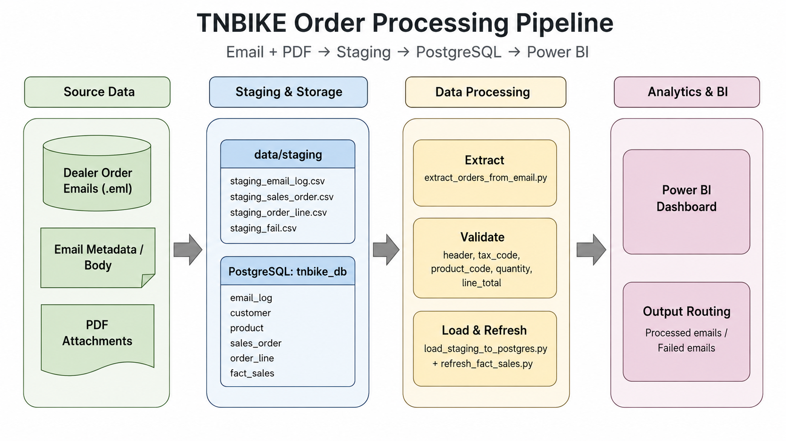

# tnbike-project

Dự án ETL/ELT cho dữ liệu bán hàng TNBIKE: chuẩn hoá dữ liệu, xây dựng PostgreSQL DWH (schema `tnbike`), và pipeline tự động đọc đơn hàng từ email (`.eml` + PDF đính kèm) để nạp vào DB và refresh `fact_sales` phục vụ Power BI.

## 1. Vấn đề về dữ liệu

- Nguồn đơn hàng đến từ email, file đính kèm là PDF; cấu trúc nội dung không đồng nhất, dễ thiếu/khuyết thông tin.
- PDF có lỗi font/encoding (đặc biệt tên sản phẩm), gây khó khăn khi parse text và map danh mục.
- Dữ liệu master (khách hàng/tỉnh thành/màu sắc) không chuẩn: sai chính tả, khác cách viết, thiếu `province_id`, màu nằm lẫn trong `product_name`.
- Cần cơ chế “chạy lại an toàn” (idempotent) để tránh trùng dữ liệu khi re-run theo batch đơn hàng.

## 2. Xử lý dữ liệu

### 2.1. Chuẩn hoá màu sản phẩm

- Trích màu từ `product_name` → xuất file kiểm tra: `data/processed/cleaned/product_cleaned.csv` (script: `src/preprocessing/clean_product_color.py`).
- Cập nhật lại `product.color` và đồng bộ `fact_sales.color` theo file cleaned (script: `src/preprocessing/update_product_color.py`).

### 2.2. Chuẩn hoá tỉnh/thành khách hàng

- Map tỉnh từ `customer.address` bằng cách chuẩn hoá text + từ điển thay thế lỗi chính tả → xuất:
  - `data/processed/cleaned/success_mapping_customer_province.csv`
  - `data/processed/cleaned/failed_mapping_customer_province.csv`
  (script: `src/preprocessing/map_customer_province.py`)
- Cập nhật `customer.province_id` và đồng bộ `fact_sales.province_id/province_name` (script: `src/preprocessing/update_customer_province_fact.py`).

## 3. Pipeline xử lý đơn hàng tự động

Sơ đồ pipeline:



Luồng xử lý (script điều phối: `src/pipeline/run_pipeline.py`):

1. **Extract**: đọc file `.eml` trong `data/incoming/eml`, lấy PDF đính kèm và parse ra các file staging CSV:
   - `data/staging/staging_sales_order.csv`
   - `data/staging/staging_order_line.csv`
   - `data/staging/staging_customer.csv` (chỉ khách hàng mới phát sinh trong batch)
   - `data/staging/staging_email_log.csv`
   - `data/staging/staging_fail.csv`, `data/staging/staging_fail_summary.csv`
2. **Load**: import staging CSV vào PostgreSQL (script: `src/pipeline/load_staging_to_postgres.py`).
3. **Refresh**: xoá/insert lại `tnbike.fact_sales` theo danh sách `so_number` trong batch vừa staging (script: `src/pipeline/refresh_fact_sales.py`).
4. **Phân loại email**:
   - Email có lỗi trong `staging_fail.csv` → move sang `data/failed/eml`
   - Email không lỗi → move sang `data/processed/eml`

Ghi chú vận hành:

- Pipeline có lock file: `data/staging/pipeline.lock` để chống chạy song song.
- Log: `logs/run_pipeline.log`.
- Nếu pipeline fail, `.eml` sẽ được giữ nguyên trong `data/incoming/eml` để debug và chạy lại.

## 4. Hướng dẫn cài đặt

### 4.1. Khởi tạo env

Tạo môi trường Python và cài dependencies:

```powershell
python -m venv venv
.\venv\Scripts\Activate.ps1
pip install -r requirements.txt
```

Cấu hình biến môi trường DB:

- `PGHOST`, `PGPORT`, `PGDATABASE`, `PGUSER`, `PGPASSWORD`

### 4.2. Khởi tạo docker

Khởi động PostgreSQL + Adminer:

```powershell
docker compose up -d
```

- PostgreSQL: `localhost:5432`
- Adminer: `http://localhost:8080` (server: `postgres`, user/pass/db theo `.env` hoặc `docker-compose.yml`)

### 4.3. Restore database (option)

Nếu muốn restore nhanh DB từ file backup:

```powershell
psql -U postgres -d tnbike_db -f backup/tnbike_db_backup.sql
```

### 4.4. Import dữ liệu (init DB từ đầu)

Nếu dựng DB mới (không dùng backup), chạy lần lượt:

```powershell
psql -U postgres -d tnbike_db -f sql/01_create_tables.sql
psql -U postgres -d tnbike_db -f sql/02_import_data.sql
psql -U postgres -d tnbike_db -f sql/03_create_email_log.sql
psql -U postgres -d tnbike_db -f sql/05_clean_province.sql
```

### 4.5. Xử lý dữ liệu (preprocessing)

Tuỳ chọn chạy các bước làm sạch (khi cần):

```powershell
python src/preprocessing/clean_product_color.py
python src/preprocessing/update_product_color.py
python src/preprocessing/map_customer_province.py
python src/preprocessing/update_customer_province_fact.py
```

### 4.6. Chạy pipeline xử lý đơn hàng T3/2026

1) Copy các file email vào `data/incoming/eml` (định dạng `.eml`).

2) Chạy pipeline:

```powershell
python src/pipeline/run_pipeline.py
```

Kết quả:

- Staging CSV tạo ở `data/staging`
- Dữ liệu được upsert vào các bảng `tnbike.sales_order`, `tnbike.order_line`, log email/khách hàng
- `tnbike.fact_sales` được refresh theo batch
- Email được move sang `data/processed/eml` hoặc `data/failed/eml`

### 4.7. Kết nối với Power BI

File dashboard: `dashboard/tnbike_dashboard.pbix`.

Mở file `.pbix` và cấu hình Data Source tới PostgreSQL:

- Server: `localhost:5432`
- Database: `tnbike_db`
- Schema: `tnbike`

## 5. Cấu trúc thư mục

